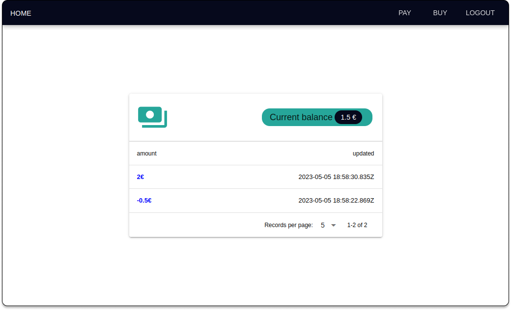

## pocketbase-app

<p align="center">
    <a href="https://pocketbase.io" target="_blank" rel="noopener">
        
    </a>
</p>


## Overview

Pocketbase-app is a web application that provides users with an easy-to-use interface for managing their finances. With this app, users can quickly check their account balance and make payments or charge money on the go. The development of this app will be explained in a future blog post [here](https://dmelo.eu/blog/) (https://dmelo.eu/blog/).

This App is based on [PocketBase](https://pocketbase.io) that is an open source Go backend, consisting of:

- embedded database (_SQLite_) with **realtime subscriptions**
- built-in **files and users management**
- convenient **Admin dashboard UI**
- and simple **REST-ish API**

and [Vue](https://vuejs.org/) with the [Quasar framework](https://quasar.dev).


### Docker

```
docker build -t pocketbase-app .
docker run -d --name pocketbase-app -v ./pb_data:/pocketbase/pb_data/ -p 127.0.0.1:8090:8090 pocketbase-app
```

### Docker Compose

```
docker-compose up --build
```

### Running

 - http://127.0.0.1:8090/ - Serves the static content from pb_public (html, css, images, etc.)
 - http://127.0.0.1:8090/_/ - Admin dashboard UI
 - http://127.0.0.1:8090/api/ - REST API


### Dev

Running with Go:

```
go run main.go serve
```

Develop the frontend:

```
cd ui
vue serve
```